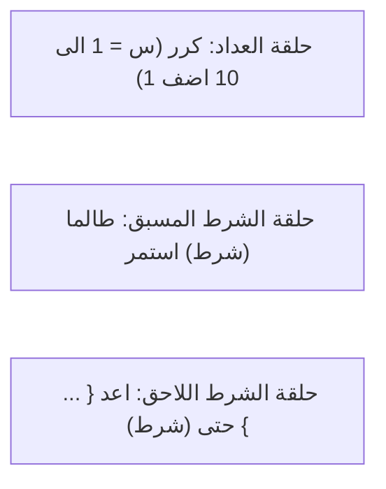

# الدليل الشامل والمفصل لقواعد لغة البرمجة العربية
### Comprehensive Specification & Reference Manual for the Arabic Programming Language

---

<div dir="rtl" style="font-family: 'Segoe UI', Tahoma, Arial, sans-serif; line-height: 1.9;">

## 📑 فهرس المحتويات

1. [مقدمة وفلسفة اللغة](#1-مقدمة-وفلسفة-اللغة)
2. [المعجم والرموز المميزة (Lexical Tokens)](#2-المعجم-والرموز-المميزة-lexical-tokens)
3. [أنواع البيانات في اللغة (Data Types)](#3-أنواع-البيانات-في-اللغة-data-types)
4. [الهيكل العام للبرنامج وقسم التعريفات (Program Structure & Declarations)](#4-الهيكل-العام-للبرنامج-وقسم-التعريفات)
   - [4.1 تعريف الثوابت (Constants)](#41-تعريف-الثوابت-ثابت)
   - [4.2 تعريف الأنواع المركبة (Types - Arrays & Records)](#42-تعريف-الأنواع-المركبة-نوع)
   - [4.3 تعريف المتغيرات (Variables)](#43-تعريف-المتغيرات-متغير)
   - [4.4 تعريف الإجراءات والدوال (Procedures)](#44-تعريف-الإجراءات-اجراء)
5. [التعليمات والجمل البرمجية (Statements)](#5-التعليمات-والجمل-البرمجية-statements)
   - [5.1 تعليمة الإسناد (Assignment)](#51-تعليمة-الإسناد)
   - [5.2 تعليمة الإدخال (Input - اقرا)](#52-تعليمة-الإدخال-اقرا)
   - [5.3 تعليمة الإخراج (Output - اطبع)](#53-تعليمة-الإخراج-اطبع)
   - [5.4 تعليمة استدعاء الإجراء (Procedure Call)](#54-تعليمة-استدعاء-الإجراء)
   - [5.5 الجمل الشرطية (Conditional Statements)](#55-الجمل-الشرطية-اذا---فان---والا)
   - [5.6 جمل وحلقات التكرار (Loop Statements)](#56-جمل-وحلقات-التكرار)
6. [التعابير والمعاملات وأسبقيتها (Expressions & Operators)](#6-التعابير-والمعاملات-وأسبقيتها)
7. [القواعد النحوية الكاملة بصيغة BNF / EBNF](#7-القواعد-النحوية-الكاملة-بصيغة-ebnf)
8. [أمثلة تطبيقية شاملة خطوة بخطوة](#8-أمثلة-تطبيقية-شاملة-خطوة-بخطوة)
9. [دليل الأخطاء الشائعة وقواعد التحليل الدلالي](#9-دليل-الأخطاء-الشائعة-وقواعد-التحليل-الدلالي)

---

## 1. مقدمة وفلسفة اللغة

**لغة البرمجة العربية** هي لغة برمجة إجرائية (Procedural / Imperative Language) عالية المستوى، تعتمد قواعدها النحوية ومفرداتها بالكامل على مفردات اللغة العربية الفصحى. صُممت اللغة لتكون واضحة البنية، قوية التنميط (Strongly Typed)، وذات بناء تركيبي شبيه بلغات باسكال و C ولكن بمنطق وقراءة عربية أصيلة من اليمين إلى اليسار.

### أهم مميزات اللغة:
- **دعم كامل للأحرف العربية**: أسماء البرامج، المتغيرات، الثوابت، الأنواع، والدوال تُكتب جميعها بحروف عربية نقية.

- **تنوع أنماط التكرار**: توفر 3 صيغ للحلقات التكرارية لتغطية كافة الخوارزميات (تكرار العداد `كرر`، تكرار الشرط المسبق `طالما`، وتكرار الشرط اللاحق `اعد .. حتى`).
- **دعم التمرير بالقيمة وبالمرجع**: إمكانية تعديل المتغيرات الأصلية عبر تمريرها كوسائط بالمرجع (`بالمرجع`) للإجراءات.
- **هياكل بيانات متقدمة**: دعم القوائم (Arrays) والسجلات ذات الحقول المتعددة (Records / Structs).

---

## 2. المعجم والرموز المميزة (Lexical Tokens)

يتعرف المحلل المعجمي (Lexer) على الرموز الأساسية التالية:

### 2.1 الكلمات المحجوزة (Keywords)
الكلمات المحجوزة هي كلمات ذات وظيفة نحوية ثابتة ولا يجوز استخدامها كأسماء متغيرات أو دوال:

| الكلمة المحجوزة | الوظيفة النحوية والدلالية |
| :--- | :--- |
| `برنامج` | الإعلان عن بداية البرنامج وتحديد اسمه |
| `ثابت` | بداية قسم تعريف الثوابت العامة |
| `نوع` | بداية قسم تعريف الأنواع المركبة المخصصة |
| `متغير` | بداية قسم التصريح عن المتغيرات |
| `اجراء` | الإعلان عن تعريف إجراء فرعي جديد |
| `بالقيمة` | تحديد نمط تمرير المعلمة كنسخة بالقيمة (الافتراضي) |
| `بالمرجع` | تحديد نمط تمرير المعلمة كعنوان بالمرجع (تعديل الأصل) |
| `قائمة` | إنشاء نوع مركب يمثل مصفوفة ذات حجم محدد |
| `سجل` | إنشاء نوع مركب يمثل سجلاً (Struct) يحتوي حقولاً |
| `من` | تُستخدم لتحديد نوع عناصر القائمة (مثال: `قائمة [10] من صحيح`) |
| `صحيح` | نوع البيانات للأعداد الصحيحة |
| `حقيقي` | نوع البيانات للأعداد العشرية / الكسرية |
| `منطقي` | نوع البيانات للقيم المنطقية |
| `حرفي` | نوع البيانات للرمز المفرد |
| `خيط_رمزي` | نوع البيانات للسلاسل النصية |
| `صح` | القيمة المنطقية الموجبة (True) |
| `خطأ` | القيمة المنطقية السالبة (False) |
| `اقرا` | تعليمة القراءة وإدخال البيانات من المستخدم |
| `اطبع` | تعليمة الإخراج والطباعة على الشاشة |
| `اذا` | بدء الجملة الشرطية |
| `فان` | ما يلي الشرط في الجملة الشرطية عند تحققه |
| `والا` | الفرع البديل في الجملة الشرطية |
| `كرر` | حلقة التكرار المحددة بعداد (For loop) |
| `الى` | تحديد الحد النهائي للعداد في حلقة `كرر` |
| `اضف` | تحديد مقدار الزيادة/الخطوة (Step) في حلقة `كرر` |
| `طالما` | حلقة التكرار المشروطة مسبقاً (While loop) |
| `استمر` | مرافقة لـ `طالما` لتحديد جسم الحلقة |
| `اعد` | حلقة التكرار المشروطة لاحقاً (Do-While / Repeat-Until) |
| `حتى` | مرافقة لـ `اعد` لتحديد شرط التوقف |

---

### 2.2 الفواصل والرموز الخاصة (Punctuators & Delimiters)

| الرمز | الاسم في النحو | الوظيفة ومواضع الاستخدام |
| :---: | :--- | :--- |
| `.` | نقطة | 1) نهاية البرنامج الرئيسي، 2) الوصول لحقول السجل (`س.حقل`)، 3) الفاصلة العشرية في الأعداد الحقيقية (`3.14`). |
| `:` | نقطتان | الفصل بين أسماء المتغيرات ونوعها في التصريح (`س, ص : صحيح`). |
| `؛` | فاصلة منقوطة | إنهاء الجمل والتعليمات والتصريحات. |
| `,` | فاصلة عادية | الفصل بين عناصر القوائم، المتغيرات في نفس السطر، وعناصر الطباعة والاستدعاء. |
| `=` | علامة المساواة | 1) تعليمة الإسناد (`س = 5`)، 2) تعيين قيمة الثابت، 3) تعيين حدود حلقة `كرر`. |
| `{` `}` | أقواس المجموعات | حصر كتلة التعليمات البرمجية (`{ ... }`) أو قائمة حقول السجل. |
| `[` `]` | أقواس مربعة | تحديد أبعاد القوائم (`قائمة [10] من صحيح`) وفهرسة عناصر المصفوفات (`ق[1]`). |
| `(` `)` | أقواس دائرية | حصر المعاملات، الشروط، المعلمات، وقوائم الإدخال والإخراج. |
| `"` | علامة تنصيص مزدوجة | حصر السلاسل النصية / الخيوط الرمزية (`"مرحبا بك"`). |
| `’` `‘` | علامات تنصيص مفردة | حصر الحرف والرمز المفرد (`’أ‘`). |

---

### 2.3 المعرفات (Identifiers)
تُستخدم لتسمية البرامج، المتغيرات، الثوابت، الأنواع، والحقول:
- **القاعدة**: تبدأ بحرف عربي (`ا` - `ي`)، ويمكن أن يتبعها أي عدد من الحروف العربية أو الأرقام (`0` - `9`) أو الشرطة السفلية `_`.
- **أمثلة صحيحة**: `العدد`, `المجموع_الكلي`, `س1`, `طالب_جديد`.
- **أمثلة غير صحيحة**: `1عدد` (تبدأ برقم)، `متغير` (كلمة محجوزة).

---

## 3. أنواع البيانات في اللغة (Data Types)

```mermaid
graph TD
    DataTypes["أنواع البيانات (Data Types)"]
    DataTypes --> Primitive["أنواع أولية (Primitive Types)"]
    DataTypes --> Composite["أنواع مركبة (Composite Types)"]
    
    Primitive --> TInt["صحيح (Integer - 64-bit)"]
    Primitive --> TFloat["حقيقي (Double / Real)"]
    Primitive --> TBool["منطقي (Boolean: صح / خطأ)"]
    Primitive --> TChar["حرفي (Character: ’س‘)"]
    Primitive --> TStr["خيط_رمزي (String: \"...\")"]
    
    Composite --> TArray["قائمة [حجم] من نوع (Array)"]
    Composite --> TRecord["سجل { حقول... } (Record/Struct)"]
```

### 3.1 الأنواع الأولية (Primitive Types)

1. **`صحيح` (Integer)**:
   - يمثل الأعداد الصحيحة الموجبة والسالبة والصفر (مثال: `0`, `42`, `-15`).
2. **`حقيقي` (Real / Float)**:
   - يمثل الأعداد ذات الفواصل العشرية (مثال: `3.14`, `0.5`, `-10.25`).
3. **`منطقي` (Boolean)**:
   - يقبل إحدى القيمتين فقط: `صح` أو `خطأ`.
4. **`حرفي` (Character)**:
   - يمثل محرفاً واحداً محصوراً بين علامتي تنصيص مفردتين (مثال: `’أ‘`, `’ج‘`).
5. **`خيط_رمزي` (String)**:
   - يمثل نصاً مكوناً من سلسلة محارف محصورة بين علامتي تنصيص مزدوجتين (مثال: `"مرحبا بالعالم"`).

---

### 3.2 الأنواع المركبة (Composite Types)

#### 1) نوع القائمة (`قائمة` - Arrays):
تُعرف باستخدام الكلمة المحجوزة `قائمة` متبوعة بالحجم بين قوسين مربعين ثم `من` ثم نوع العناصر:
```text
نوع
    جدول_الدرجات = قائمة [10] من صحيح؛
    مصفوفة_الاحرف = قائمة [5] من حرفي؛
```

#### 2) نوع السجل (`سجل` - Records / Structs):
يُعرف باستخدام الكلمة المحجوزة `سجل` متبوعة بقائمة الحقول وأنواعها بين أقواس معقوصة `{}`:
```text
نوع
    بيانات_الطالب = سجل {
        الرقم : صحيح؛
        المعدل : حقيقي؛
        ناجح : منطقي
    }؛
```

---

## 4. الهيكل العام للبرنامج وقسم التعريفات

يتكون أي برنامج مكتمل في لغة البرمجة العربية من الترويسة الرئيسية متبوعة بكتلة البرنامج وتنتهي بالنقطة:

```text
برنامج <اسم_البرنامج>؛
[قسم_التعريفات]
{
    // قائمة التعليمات التنفيذية
} .
```

---

### 4.1 تعريف الثوابت (`ثابت`)
يُستخدم لتعريف قيم ثابتة لا تتغير أثناء تنفيذ البرنامج.
- **الصيغة النحوية**:
```text
ثابت
    <اسم_الثابت> = <القيمة>؛
```
- **مثال تطبيقي**:
```text
برنامج حساب_الدائرة؛
ثابت
    النسبة_التقريبية = 3.14159؛
    الحد_الاقصى = 100؛
    رسالة_الترحيب = "مرحبا بكم في النظام"؛
    حرف_البداية = ’أ‘؛
    الوضع_مفعل = صح؛
{
    اطبع(رسالة_الترحيب)؛
} .
```

---

### 4.2 تعريف الأنواع المركبة (`نوع`)
يسمح للمبرمج بإنشاء هياكل بيانات جديدة.
- **الصيغة النحوية**:
```text
نوع
    <اسم_النوع> = قائمة [<الحجم>] من <نوع_البيانات>؛
    <اسم_النوع> = سجل { <اسم_الحقل> : <نوع_البيانات>؛ ... }؛
```
- **مثال تطبيقي**:
```text
نوع
    قائمة_الرواتب = قائمة [5] من حقيقي؛
    سجل_الموظف = سجل {
        رقم_الموظف : صحيح؛
        الراتب : حقيقي
    }؛
```

---

### 4.3 تعريف المتغيرات (`متغير`)
يُستخدم لحجز أماكن في الذاكرة لتخزين البيانات أثناء التنفيذ.
- **الصيغة النحوية**:
```text
متغير
    <اسم_المتغير1>, <اسم_المتغير2> : <نوع_البيانات>؛
```
- **مثال تطبيقي**:
```text
متغير
    س, ص, المجموع : صحيح؛
    المعدل, النسبة : حقيقي؛
    حالة_النجاح : منطقي؛
    درجات_الطلاب : قائمة_الرواتب؛
    موظف1 : سجل_الموظف؛
```

---

### 4.4 تعريف الإجراءات (`اجراء`)
تُستخدم لتنظيم الكود إلى وحدات برمجية قابلة لإعادة الاستخدام، وتدعم تمرير المعلمات:
- **`بالقيمة` (Pass by Value)**: يتم إنشاء نسخة من القيمة (لا تتأثر القيمة الأصلية).
- **`بالمرجع` (Pass by Reference)**: يتم إرسال عنوان المتغير (أي تعديل داخل الإجراء يُغير المتغير الأصلي).

- **الصيغة النحوية**:
```text
اجراء <اسم_الإجراء> ( [بالقيمة | بالمرجع] <المتغيرات> : <النوع> [؛ ...] )؛
[قسم_التعريفات_المحلية]
{
    // تعليمات الإجراء
}؛
```

- **مثال تفصيلي للإجراءات (تبديل القيم بالمرجع)**:
```text
برنامج تجربة_الاجراءات؛
متغير
    الاول, الثاني : صحيح؛

اجراء تبديل (بالمرجع أ, ب : صحيح)؛
متغير
    مؤقت : صحيح؛
{
    مؤقت = أ؛
    أ = ب؛
    ب = مؤقت؛
}؛

{
    الاول = 10؛
    الثاني = 20؛
    اطبع("قبل التبديل: الاول = ", الاول, " الثاني = ", الثاني)؛
    تبديل(الاول, الثاني)؛
    اطبع("بعد التبديل: الاول = ", الاول, " الثاني = ", الثاني)؛
} .
```

---

## 5. التعليمات والجمل البرمجية (Statements)

### 5.1 تعليمة الإسناد
تُستخدم لتخزين ناتج تعبير رياضي أو منطقي في متغير، أو عنصر مصفوفة، أو حقل سجل:
```text
س = 15 + 5؛
قائمة_الاعداد[1] = 90؛
موظف1.الراتب = 4500.50؛
```

---

### 5.2 تعليمة الإدخال (`اقرا`)
تستقبل القيمة من المدخلات القياسية وتخزنها في المتغير المحدد:
```text
اقرا(س)؛
اقرا(قائمة_الاعداد[2])؛
اقرا(طالب.العمر)؛
```

---

### 5.3 تعليمة الإخراج (`اطبع`)
تطبع القيم، المتغيرات، والنصوص المحصورة بين تنصيص:
```text
اطبع("حاصل جمع س + ص = ", المجموع)؛
```

---

### 5.4 تعليمة استدعاء الإجراء
استدعاء الإجراء الفرعي وتمرير المعاملات المطلوبة:
```text
حساب_المتوسط(س, ص, ع)؛
طباعة_التقرير()؛
```

---

### 5.5 الجمل الشرطية (`اذا` - `فان` - `والا`)

توفر اللغة 3 أشكال للجمل الشرطية:

#### 1) جملة `اذا` البسيطة (Simple If):
```text
اذا (س > 0) فان {
    اطبع("العدد موجب")؛
}
```

#### 2) جملة `اذا` و `والا` (If-Else):
```text
اذا (الدرجة >= 50) فان {
    اطبع("ناجح")؛
} والا {
    اطبع("راسب")؛
}
```

#### 3) جملة `اذا` و `والا اذا` المتعددة (If - Else If - Else):
> [!IMPORTANT]
> وفقاً لقواعد النحو الرسمية للمشروع، عند كتابة فروع `والا اذا` متعددة، توضع **فاصلة منقوطة `؛`** قبل كلمة `والا`:
```text
اذا (الدرجة >= 90) فان {
    اطبع("ممتاز")؛
}؛
والا اذا (الدرجة >= 80) فان {
    اطبع("جيد جدا")؛
}؛
والا اذا (الدرجة >= 70) فان {
    اطبع("جيد")؛
}؛
والا {
    اطبع("راسب")؛
}
```

---

### 5.6 جمل وحلقات التكرار



#### 1) حلقة العداد (`كرر` - For Loop):
تُستخدم عندما يكون عدد مرات التكرار معروفاً مسبقاً، مع خيار تحديد الخطوة (`اضف`).
- **الصيغة**:
```text
كرر (المتغير = البداية الى النهاية [اضف الخطوة]) {
    // التعليمات
}
```
- **مثال**:
```text
// تكرار مع خطوة افتراضية (+1)
كرر (ع = 1 الى 5) {
    اطبع("العداد = ", ع)؛
}

// تكرار مع خطوة مخصصة (+2)
كرر (ع = 2 الى 10 اضف 2) {
    اطبع("العدد الزوجي: ", ع)؛
}
```

#### 2) حلقة الشرط المسبق (`طالما` .. `استمر` - While Loop):
يتم فحص الشرط قبل الدخول إلى جسم الحلقة.
- **الصيغة**:
```text
طالما (الشرط) استمر {
    // التعليمات
}
```
- **مثال**:
```text
العداد = 1؛
طالما (العداد <= 5) استمر {
    اطبع("قيمة العداد: ", العداد)؛
    العداد = العداد + 1؛
}
```

#### 3) حلقة الشرط اللاحق (`اعد` .. `حتى` - Do-While / Repeat-Until Loop):
يتم تنفيذ جسم الحلقة مرة واحدة على الأقل، ثم يُفحص الشرط عند النهاية للتكرار:
- **الصيغة**:
```text
اعد {
    // التعليمات
} حتى (الشرط)
```
- **مثال**:
```text
الرقم = 10؛
اعد {
    اطبع("الرقم الحالي: ", الرقم)؛
    الرقم = الرقم - 1؛
} حتى (الرقم > 0)
```

---

## 6. التعابير والمعاملات وأسبقيتها

### 6.1 جدول المعاملات الكامل

| نوع المعامل | الرمز | المعنى والوظيفة | مثال توضيحي | النتيجة |
| :--- | :---: | :--- | :--- | :---: |
| **أسّي** | `^` | رفع العدد إلى قوة أسية | `2 ^ 3` | `8` |
| **ضرب وقسمة** | `*` | عملية الضرب الحسابي | `4 * 3` | `12` |
| | `/` | قسمة حقيقية (ناتج عشري) | `5 / 2` | `2.5` |
| | `\` | قسمة صحيحة (إهمال الكسور) | `5 \ 2` | `2` |
| | `%` | باقي القسمة الصحيحة (Modulus) | `7 % 3` | `1` |
| **جمع وطرح** | `+` | الجمع الحسابي أو إشارة الموجب | `10 + 20` | `30` |
| | `-` | الطرح الحسابي أو إشارة السالب | `15 - 5` | `10` |
| **مقارنة وربط** | `==` | فحص التساوي | `5 == 5` | `صح` |
| | `!=` | فحص عدم التساوي | `5 != 3` | `صح` |
| | `<` | أصغر من | `3 < 7` | `صح` |
| | `>` | أكبر من | `8 > 12` | `خطأ` |
| | `<=` | أصغر من أو يساوي | `5 <= 5` | `صح` |
| | `>=` | أكبر من أو يساوي | `9 >= 10` | `خطأ` |
| **منطقي** | `!` | نفي القيمة المنطقية (NOT) | `! صح` | `خطأ` |
| | `&&` | عطف منطقي (AND) | `صح && خطأ` | `خطأ` |
| | `\|\|` | فصل منطقي (OR) | `صح \|\| خطأ` | `صح` |

---

### 6.2 جدول أسبقية المعاملات (Operator Precedence)

يتم تقييم العمليات الحسابية والمنطقية وفق الترتيب الصارم التالي (من الأعلى أسبقية إلى الأدنى):

```
الأعلى أسبقية:
  1. الأقواس: ( ... )
  2. النفي ومعاملات الإشارة الأحادية: ! ، + ، -
  3. الأس: ^
  4. الضرب، القسمة، باقي القسمة، وعطف AND: * ، / ، \ ، % ، &&
  5. الجمع، الطرح، وفصل OR: + ، - ، ||
  6. معاملات المقارنة والعلاقات: == ، != ، < ، > ، <= ، >=
الأدنى أسبقية: الإسناد =
```

> [!TIP]
> **مثال حسابي توضيحي للأسبقية**:
> التعبير: `النتيجة = 2 + 3 * 2 ^ 3`
> 1. يتم أولاً حساب الأس `2 ^ 3 = 8`.
> 2. يتم ثانياً حساب الضرب `3 * 8 = 24`.
> 3. يتم ثالثاً حساب الجمع `2 + 24 = 26`.
> 4. يتم أخيراً إسناد `26` للمتغير `النتيجة`.

---

## 7. القواعد النحوية الكاملة بصيغة EBNF

```ebnf
<برنامج> ::= "برنامج" <معرف> "؛" <كتلة_برمجية> "."

<كتلة_برمجية> ::= [ <جزء_التعريفات> ] <قائمة_التعليمات>

<جزء_التعريفات> ::= [ <تعريف_الثوابت> ] 
                    [ <تعريف_الانواع> ] 
                    [ <تعريف_المتغيرات> ] 
                    [ <تعريف_الاجراءات> ]

<تعريف_الثوابت> ::= "ثابت" <تعريف_ثابت> { <تعريف_ثابت> }
<تعريف_ثابت> ::= <معرف> "=" <قيمة_ثابت> "؛"

<تعريف_الانواع> ::= "نوع" <تعريف_نوع> { <تعريف_نوع> }
<تعريف_نوع> ::= <معرف> "=" <نوع_مركب> "؛"
<نوع_مركب> ::= <نوع_قائمة> | <نوع_سجل>
<نوع_قائمة> ::= "قائمة" "[" <رقم_صحيح> "]" "من" <نوع_بيانات>
<نوع_سجل> ::= "سجل" "{" <قائمة_حقول> "}"
<قائمة_حقول> ::= <تعريف_حقل> { "؛" <تعريف_حقل> }
<تعريف_حقل> ::= <معرف> { "،" <معرف> } ":" <نوع_بيانات>

<تعريف_المتغيرات> ::= "متغير" <تعريف_متغير> { <تعريف_متغير> }
<تعريف_متغير> ::= <مجموعة_متغيرات> "؛"
<مجموعة_متغيرات> ::= <معرف> { "،" <معرف> } ":" <نوع_بيانات>

<نوع_بيانات> ::= "صحيح" | "حقيقي" | "منطقي" | "حرفي" | "خيط_رمزي" | <معرف>

<تعريف_الاجراءات> ::= <تعريف_اجراء> { <تعريف_اجراء> }
<تعريف_اجراء> ::= <رأس_اجراء> <كتلة_برمجية> "؛"
<رأس_اجراء> ::= "اجراء" <معرف> "(" [ <قائمة_معلمات_شكلية> ] ")" "؛"
<قائمة_معلمات_شكلية> ::= <تعريف_معلمة> { "؛" <تعريف_معلمة> }
<تعريف_معلمة> ::= [ "بالقيمة" | "بالمرجع" ] <مجموعة_متغيرات>

<قائمة_التعليمات> ::= "{" <تعليمة> { "؛" <تعليمة> } "}"

<تعليمة> ::= <تعليمة_اسناد>
           | <تعليمة_ادخال>
           | <تعليمة_اخراج>
           | <تعليمة_استدعاء>
           | <تعليمة_شرط>
           | <تعليمة_تكرار>
           | <قائمة_التعليمات>

<تعليمة_اسناد> ::= <متغير_وصول> "=" <تعبير>
<تعليمة_ادخال> ::= "اقرا" "(" <متغير_وصول> ")"
<تعليمة_اخراج> ::= "اطبع" "(" <قائمة_طباعة> ")"
<قائمة_طباعة> ::= <عنصر_طباعة> { "،" <عنصر_طباعة> }
<عنصر_طباعة> ::= <تعبير> | <حرفي>

<تعليمة_استدعاء> ::= <معرف> "(" [ <معلمة_حقيقية> { "،" <معلمة_حقيقية> } ] ")"

<تعليمة_شرط> ::= "اذا" "(" <تعبير> ")" "فان" <تعليمة> [ "والا" <تعليمة> ]
               | "اذا" "(" <تعبير> ")" "فان" <تعليمة> "؛" "والا" "اذا" "(" <تعبير> ")" "فان" <تعليمة> ...

<تعليمة_تكرار> ::= "كرر" "(" <معرف> "=" <تعبير> "الى" <تعبير> [ "اضف" <تعبير> ] ")" <تعليمة>
                 | "طالما" "(" <تعبير> ")" "استمر" <تعليمة>
                 | "اعد" <تعليمة> "حتى" "(" <تعبير> ")"

<تعبير> ::= <تعبير_بسيط> [ <معامل_ربط> <تعبير_بسيط> ]
<تعبير_بسيط> ::= [ <معامل_اشارة> ] <حد> { <معامل_جمع> <حد> }
<حد> ::= <عامل> { <معامل_ضرب> <عامل> }
<عامل> ::= <قيمة_ثابت> | <متغير_وصول> | "(" <تعبير> ")" | "!" <عامل>

<متغير_وصول> ::= <معرف> [ "[" <تعبير> "]" | "." <معرف> ]
```

---

## 8. أمثلة تطبيقية شاملة خطوة بخطوة

### مثال 1: العمليات الحسابية والمنطقية
```text
برنامج الحسابات_الشاملة؛
ثابت
    الحد = 100؛
متغير
    س, ص, الجمع, الطرح, الضرب, باقي_القسمة : صحيح؛
    القسمة_الحقيقية : حقيقي؛
    نتيجة_الاس : صحيح؛
    هل_موجب : منطقي؛
{
    س = 10؛
    ص = 3؛
    
    الجمع = س + ص؛
    الطرح = س - ص؛
    الضرب = س * ص؛
    القسمة_الحقيقية = س / ص؛
    باقي_القسمة = س % ص؛
    نتيجة_الاس = 2 ^ 3؛
    
    هل_موجب = (الجمع > 0) && (س <= الحد)؛
    
    اطبع("الجمع: ", الجمع)؛
    اطبع("الطرح: ", الطرح)؛
    اطبع("الضرب: ", الضرب)؛
    اطبع("القسمة: ", القسمة_الحقيقية)؛
    اطبع("باقي القسمة: ", باقي_القسمة)؛
    اطبع("الأس 2^3: ", نتيجة_الاس)؛
    اطبع("الشرط المنطقي: ", هل_موجب)؛
} .
```

---

### مثال 2: استخدام الحلقات التكرارية الثلاث لحساب المجموع
```text
برنامج مقارنة_الحلقات؛
متغير
    مجموع1, مجموع2, مجموع3 : صحيح؛
    ع : صحيح؛
{
    // 1. حلقة كرر
    مجموع1 = 0؛
    كرر (ع = 1 الى 5) {
        مجموع1 = مجموع1 + ع؛
    }؛
    اطبع("مجموع حلقة كرر: ", مجموع1)؛

    // 2. حلقة طالما
    مجموع2 = 0؛
    ع = 1؛
    طالما (ع <= 5) استمر {
        مجموع2 = مجموع2 + ع؛
        ع = ع + 1؛
    }؛
    اطبع("مجموع حلقة طالما: ", مجموع2)؛

    // 3. حلقة اعد حتى
    مجموع3 = 0؛
    ع = 1؛
    اعد {
        مجموع3 = مجموع3 + ع؛
        ع = ع + 1؛
    } حتى (ع <= 5)؛
    اطبع("مجموع حلقة اعد حتى: ", مجموع3)؛
} .
```

---

### مثال 3: استخدام المصفوفات والسجلات والإجراءات بالمرجع
```text
برنامج ادارة_الطلاب؛
نوع
    قائمة_الدرجات = قائمة [3] من صحيح؛
    سجل_الطالب = سجل {
        رقم_الجلوس : صحيح؛
        مجموع_الدرجات : صحيح؛
        ناجح : منطقي
    }؛

متغير
    طالب1 : سجل_الطالب؛
    درجات : قائمة_الدرجات؛

اجراء تهيئة_الطالب (بالمرجع ط : سجل_الطالب ؛ بالقيمة رقم : صحيح)؛
{
    ط.رقم_الجلوس = رقم؛
    ط.مجموع_الدرجات = 0؛
    ط.ناجح = خطأ؛
}؛

اجراء تقييم_الطالب (بالمرجع ط : سجل_الطالب ؛ بالقيمة مجموع : صحيح)؛
{
    ط.مجموع_الدرجات = مجموع؛
    اذا (مجموع >= 150) فان {
        ط.ناجح = صح؛
    } والا {
        ط.ناجح = خطأ؛
    }
}؛

{
    تهيئة_الطالب(طالب1, 101)؛
    
    درجات[1] = 60؛
    درجات[2] = 75؛
    درجات[3] = 80؛
    
    تقييم_الطالب(طالب1, درجات[1] + درجات[2] + درجات[3])؛
    
    اطبع("رقم الطالب: ", طالب1.رقم_الجلوس)؛
    اطبع("المجموع: ", طالب1.مجموع_الدرجات)؛
    اطبع("حالة النجاح: ", طالب1.ناجح)؛
} .
```

---

## 9. دليل الأخطاء الشائعة وقواعد التحليل الدلالي

يقوم المترجم بفحص الكود عبر عدة مراحل ويكتشف الأخطاء التالية مع تحديد السطر الدقيق:

### 1) أخطاء معجمية (Lexical Errors):
- استخدام رموز غير معروفة أو غير مدعومة خارج السلاسل النصية (مثل `$`, `@`, `#`).
- عدم إغلاق علامة التنصيص المزدوجة `"..."` في الخيوط الرمزية.

### 2) أخطاء نحوية (Syntax Errors):
- نسيان النقطة `.` في نهاية البرنامج بعد القوس المغلّق `}`.
- نسيان الفاصلة المنقوطة `؛` بعد الجمل الإسنادية أو رؤوس الإجراءات.
- عدم توازن الأقواس `{ }`, `( )`, `[ ]`.
- كتابة تعليمة غير صالحة في غير موضعها.

### 3) أخطاء دلالية (Semantic Errors):
- **استخدام متغير غير مصرح به**: محاولة إسناد أو قراءة متغير لم يتم تعريفه مسبقاً في قسم `متغير`.
- **إعادة تعريف متغير**: تعريف اسم المتغير مرتين في نفس النطاق (Scope).
- **عدم توافق الأنواع (Type Mismatch)**: إسناد قيمة نصية لمتغير صحيح، أو استخدام عمليات غير ملائمة لنوع المتغير.
- **التعديل على الثوابت**: محاولة إسناد قيمة جديدة لثابت تم تعريفه في قسم `ثابت`.
- **تجاوز حدود المصفوفة**: استخدام فهرس خارج مجال تعريف القائمة.
- **استدعاء خاطئ للإجراءات**: عدم تطابق عدد أو أنواع المعاملات، أو تمرير تعبير لقيمة معلمة معرفة بـ `بالمرجع`.

---

</div>
